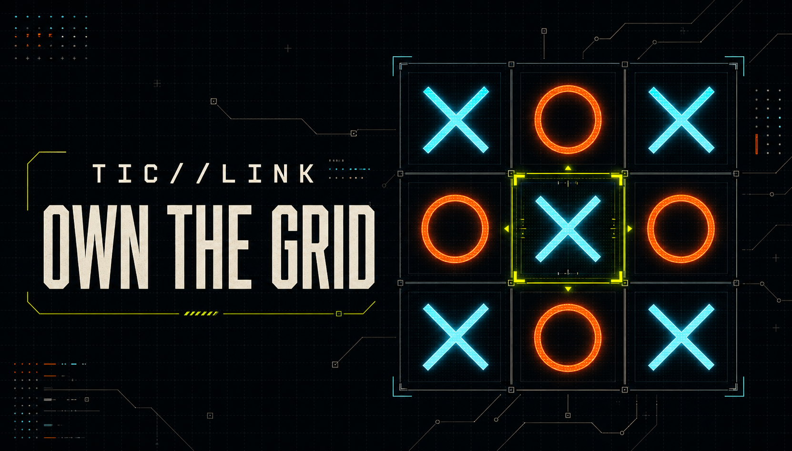
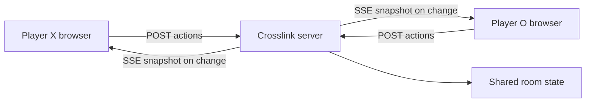

# Crosslink

Crosslink is a browser-based multiplayer Tic-Tac-Toe networking application built for the CS5700 final project. Two players can enter the same network room, receive synchronized game state, exchange messages, track results, inspect connection activity, and request rematches.



## Features

- Automatic quick matchmaking
- Private rooms with six-character invite codes
- Server-authoritative turns and move validation
- Sub-second board synchronization
- In-game text chat
- Persistent wins, losses, draws, and games played
- Two-player rematch voting
- Room activity log and live connection status
- Responsive, keyboard-accessible interface

## Technology

- Next.js, React, and TypeScript
- Next.js route handlers for the game API
- Server-Sent Events for pushing state to both players
- One in-memory server store for rooms, players, chat, and activity
- Plain CSS for the responsive interface

## Architecture



The browser never decides whether a move is legal. Each action is sent to the server as an ordinary `POST` and checked against the player identity, active turn, and current board. The server then pushes one full room snapshot to both players over their open Server-Sent Events stream.

Nothing is transmitted while a room is idle. An earlier version polled the full room state every 850 ms regardless of whether anything had changed, which cost between 753 bytes and 27 KB per request per player; snapshots are now sent only on a join, move, message, or rematch. Measured end-to-end delivery from one player's click to the other player's board is about 39 ms.

## Server state

| State | Purpose |
| --- | --- |
| Rooms | Match status, board, players, turn, winner, round, and rematch votes |
| Players | Display name and win/loss/draw statistics for the current server session |
| Messages | Time-ordered room chat |
| Activity | Room creation, joins, moves, messages, completed rounds, and rematches |

## API

| Method | Route | Purpose |
| --- | --- | --- |
| `POST` | `/api/lobby` | Quick match, create a room, or join by code |
| `GET` | `/api/rooms/:code/stream` | Server-Sent Events stream of room snapshots |
| `POST` | `/api/rooms/:code/move` | Validate and apply a move |
| `POST` | `/api/rooms/:code/message` | Add an in-room chat message |
| `POST` | `/api/rooms/:code/rematch` | Submit a rematch vote |

## Run locally

Requirements:

- Node.js 22.13 or newer

Install dependencies and start the development server:

```bash
npm ci
npm run dev
```

Open `http://localhost:3000` in two browser windows. Create a private room in the first window and join its code in the second, or choose Find a match in both.

The game state is intentionally kept in memory and resets when the server stops. This keeps the project small and easy to explain.

## Verifying it works

Run two browser windows side by side and confirm:

- Both boards stay identical as moves are made, with no page reloads
- A move out of turn, or onto a taken square, is rejected
- Chat, win, loss, draw, and rematch all behave correctly
- The status indicator reads **Live** while connected

`npm run lint` covers static checks.

## Presentation

Open `presentation/index.html` in a browser to run the reveal.js deck offline (arrow keys or on-screen controls to navigate). The timed talking script is kept separately in `presentation/speaker-script.md`.

## Design and security notes

- Random UUIDs identify temporary player sessions.
- Room codes exclude visually ambiguous characters.
- Names and messages are normalized and length-limited.
- The server validates room membership, turns, board positions, and rematch votes.
- The in-memory server store is the source of truth; browser storage only remembers the current temporary room session.
- No account authentication is required by the selected project specification.

## Project structure

```text
app/
  api/                  Server endpoints, including the SSE stream
  GameClient.tsx        Lobby, board, chat, and activity interface
  globals.css           Visual design, shared palette with the slides
lib/game.ts             Game logic, in-memory room store, and broadcast
presentation/           reveal.js deck and speaker script
```
