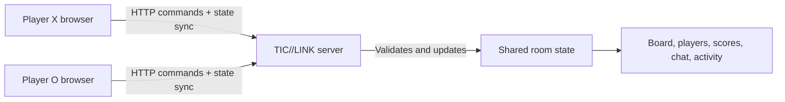

# TIC//LINK

TIC//LINK is a browser-based multiplayer Tic-Tac-Toe networking application built for the CS5700 final project. Two players can enter the same network room, receive synchronized game state, exchange messages, track results, inspect connection activity, and request rematches.


## Features

- Automatic quick matchmaking
- Private rooms with six-character invite codes
- Server-authoritative turns and move validation
- Sub-second board synchronization
- In-game text chat
- Persistent wins, losses, draws, and games played
- Two-player rematch voting
- Room activity log and connection latency
- Responsive, keyboard-accessible interface

## Technology

- Next.js, React, and TypeScript
- Next.js route handlers for the game API
- One in-memory server store for rooms, players, chat, and activity
- Plain CSS for the responsive interface

## Architecture



The browser never decides whether a move is legal. Each move is sent to the local server and checked against the player identity, active turn, and current board. Both players retrieve the same authoritative room state every 850 milliseconds.

## Server state

| State | Purpose |
| --- | --- |
| Rooms | Match status, board, players, turn, winner, round, and rematch votes |
| Players | Display name and win/loss/draw statistics for the current server session |
| Messages | Time-ordered room chat |
| Activity | Room creation, joins, moves, messages, completed rounds, and rematches |

## API

| Method | Route | Purpose |
| --- | --- | --- |
| `POST` | `/api/lobby` | Quick match, create a room, or join by code |
| `GET` | `/api/rooms/:code` | Retrieve the synchronized room state |
| `POST` | `/api/rooms/:code/move` | Validate and apply a move |
| `POST` | `/api/rooms/:code/message` | Add an in-room chat message |
| `POST` | `/api/rooms/:code/rematch` | Submit a rematch vote |

## Run locally

Requirements:

- Node.js 22.13 or newer

Install dependencies and start the development server:

```bash
npm ci
npm run dev
```

Open `http://localhost:3000` in two browser windows. Create a private room in the first window and join its code in the second, or select Quick Match in both.

The game state is intentionally kept in memory and resets when the server stops. This keeps the project small and easy to explain.

## Test

Run the build and source checks:

```bash
npm test
```

With the local server running, execute the full two-player integration test:

```bash
node --test tests/api.integration.mjs
```

The integration test verifies room creation, joining, synchronized moves, out-of-turn rejection, chat, a completed match, score updates, and a two-player rematch.

## Presentation

Open `presentation/index.html` in a browser to run the reveal.js deck offline (arrow keys or on-screen controls to navigate). The timed talking script is kept separately in `presentation/speaker-script.md`.

## Design and security notes

- Random UUIDs identify temporary player sessions.
- Room codes exclude visually ambiguous characters.
- Names and messages are normalized and length-limited.
- The server validates room membership, turns, board positions, and rematch votes.
- The in-memory server store is the source of truth; browser storage only remembers the current temporary room session.
- No account authentication is required by the selected project specification.

## Project structure

```text
app/
  api/                  Server endpoints
  GameClient.tsx        Lobby, board, chat, and telemetry interface
  globals.css           Responsive visual design
lib/game.ts             Shared game logic and in-memory room store
tests/                  Build and multiplayer integration tests
```
