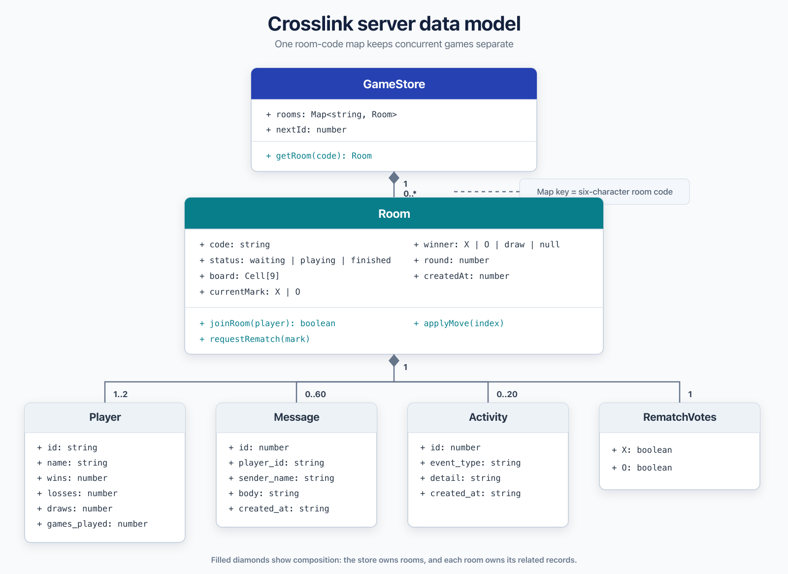

# Crosslink

Crosslink is a browser-based multiplayer Tic-Tac-Toe networking application built for the CS5700 final project. Two players can enter the same network room, receive synchronized game state, exchange messages, track results, inspect connection activity, and request rematches.

## How the code fits together

Crosslink uses a small client-server design. The React frontend handles the screen, form inputs, connection status, and the latest game snapshot. It uses React's built-in state.

Player actions go to Next.js route handlers as `POST` requests. The browser asks to join a room, make a move, send a message, or request a rematch. The server checks each request before it changes the game. This keeps move validation and turn order out of the browser, where either player could change them.

The source of truth is the in-memory store in `lib/game.ts`. It is a `Map` keyed by the six-character room code. Each value contains one room's board, players, turn, score, chat messages, activity history, and rematch votes. Because every room has a different key, one server can run many separate games at the same time.

Each player also keeps one Server-Sent Events connection open. After the server changes a room, it sends the same full room snapshot to both players. React saves that snapshot in state and renders it. The browser automatically reconnects after a temporary connection loss. If the server restarts, however, the rooms are gone because the store is not a database.



The diagram is a UML-style view of the data model. The TypeScript code uses types and separate functions rather than JavaScript `class` declarations.

## Features

- Automatic quick matchmaking
- Private rooms with six-character invite codes
- Server-authoritative turns and move validation
- Sub-second board synchronization
- In-game text chat
- Persistent wins, losses, draws, and games played
- Two-player rematch voting
- Room activity log and live connection status
- Responsive, keyboard-accessible interface

## Technology

- Next.js, React, and TypeScript
- Next.js route handlers for the game API
- Server-Sent Events for pushing state to both players
- One in-memory server store for rooms, players, chat, and activity
- Plain CSS for the responsive interface

## Network behavior

Nothing is transmitted while a room is idle. An earlier version polled the full room state every 850 ms regardless of whether anything had changed. An empty room cost 753 bytes per request, while a room with a full message history reached 27 KB. The current version sends snapshots only after a join, move, message, or rematch. Measured delivery from one player's click to the other player's board is about 39 ms.

## Server state

| State | Purpose |
| --- | --- |
| Rooms | Match status, board, players, turn, winner, round, and rematch votes |
| Players | Display name and win/loss/draw statistics for the current server session |
| Messages | Time-ordered room chat |
| Activity | Room creation, joins, moves, messages, completed rounds, and rematches |

## API

| Method | Route | Purpose |
| --- | --- | --- |
| `POST` | `/api/lobby` | Quick match, create a room, or join by code |
| `GET` | `/api/rooms/:code/stream` | Server-Sent Events stream of room snapshots |
| `POST` | `/api/rooms/:code/move` | Validate and apply a move |
| `POST` | `/api/rooms/:code/message` | Add an in-room chat message |
| `POST` | `/api/rooms/:code/rematch` | Submit a rematch vote |

## Run locally

Requirements:

- Node.js 22.13 or newer

Install dependencies and start the development server:

```bash
npm ci
npm run dev
```

Open `http://localhost:3000` in two browser windows. Create a private room in the first window and join its code in the second, or choose Find a match in both.

The game state is intentionally kept in memory and resets when the server stops. This keeps the project small and easy to explain.

## Verifying it works

Run two browser windows side by side and confirm:

- Both boards stay identical as moves are made, with no page reloads
- A move out of turn, or onto a taken square, is rejected
- Chat, win, loss, draw, and rematch all behave correctly
- The status indicator reads **Live** while connected

`npm run lint` covers static checks.

## Project materials

- [Final project report](output/pdf/Crosslink-Report.pdf)
- Open `presentation/index.html` in a browser to run the reveal.js deck offline. Use the arrow keys or on-screen controls to move through the slides. The timed talking script is in `presentation/speaker-script.md`.

## Design and security notes

- Random UUIDs identify temporary player sessions.
- Room codes exclude visually ambiguous characters.
- Names and messages are normalized and length-limited.
- The server validates room membership, turns, board positions, and rematch votes.
- The in-memory server store is the source of truth; browser storage only remembers the current temporary room session.
- No account authentication is required by the selected project specification.

## Project structure

```text
app/
  api/                  Server endpoints, including the SSE stream
  GameClient.tsx        Lobby, board, chat, and activity interface
  globals.css           Visual design, shared palette with the slides
lib/game.ts             Game logic, in-memory room store, and broadcast
presentation/           reveal.js deck and speaker script
```
